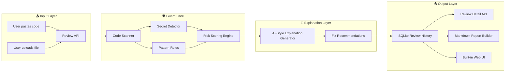

<div align="center">

# 🛡️ DevGuard AI

### AI-Style Code Security Reviewer Backend  
**Code scanning • Risk scoring • Human-readable findings • Fix recommendations • Markdown reports**

<br />


<br />

**DevGuard AI is a Python/FastAPI security reviewer that scans source code for common risky patterns, explains findings in simple language, stores review history, and generates Markdown security reports.**

</div>

---

## ✨ Overview

DevGuard AI is a defensive developer-security tool built to help programmers understand risky code before it becomes a real problem.

The project analyzes pasted code or uploaded files and looks for common security mistakes such as hardcoded passwords, possible API keys, weak password examples, SQL injection-style patterns, unsafe shell execution, debug mode configuration, and insecure hashing.

Instead of only showing warnings, DevGuard AI explains **why** each issue matters and gives safer recommendations.

> DevGuard AI is not a professional SAST replacement.  
> It is an educational, portfolio-focused backend project that demonstrates secure coding awareness, API design, and AI-style explanation logic.

---

## 🧠 Why I Built This

Beginner developers often push secrets, weak passwords, debug settings, or unsafe patterns into their projects without realizing the risk.

I built DevGuard AI to create a tool that helps developers learn from their code. My goal was to build something more serious than a simple scanner: a backend system that accepts code, reviews it, scores the risk, stores results, and generates readable reports.

This project is part of my AI engineering, backend development, and cybersecurity portfolio.

---

## 🛡️ Guardian Architecture Scheme

DevGuard AI works like a guardian pipeline: code enters the system, scanner services inspect it, the risk engine scores it, and the output layer turns the results into explanations and reports.



---

## 🔥 Core Features

| Feature | Description |
|---|---|
| Code Review API | Accepts source code and returns structured security findings |
| File Upload UI | Supports local code file upload through the built-in interface |
| Risk Scoring | Generates a 0–100 risk score |
| Risk Levels | Classifies reviews as `LOW`, `MEDIUM`, `HIGH`, or `CRITICAL` |
| Secret Detection | Looks for hardcoded passwords, tokens, API keys, and secrets |
| Unsafe Pattern Detection | Flags risky code patterns like debug mode or unsafe shell execution |
| SQL Injection-Style Detection | Detects risky string-built query patterns |
| AI-Style Explanations | Explains findings in human-readable language |
| Fix Recommendations | Suggests safer coding practices |
| Review History | Stores previous reviews in SQLite |
| Markdown Reports | Generates clean security review reports |
| Built-in UI | Provides a simple browser interface served by FastAPI |
| Render Deployment Ready | Includes deployment configuration files |

---

## 🔍 Detection Rules

DevGuard AI uses static, rule-based code analysis.

| Rule | What it Detects |
|---|---|
| Hardcoded Password | Password-like variables written directly in code |
| API Key / Token Pattern | Possible hardcoded tokens, keys, or secrets |
| Weak Password Example | Common weak values such as `admin123` or `password123` |
| SQL Injection-Style Pattern | Query strings built with direct user input |
| Unsafe Shell Execution | Risky command execution patterns |
| Debug Mode Enabled | Development debug settings left enabled |
| Insecure Hash Usage | Weak hash functions such as MD5 or SHA1 |
| Environment File Exposure | Mentions of `.env` or local secret files |

> DevGuard AI reports possible risks. It does not claim certainty, execute code, exploit code, or interact with external systems.

---

## ⚙️ Tech Stack

| Layer | Technology |
|---|---|
| Language | Python |
| Backend Framework | FastAPI |
| Validation | Pydantic |
| Database ORM | SQLAlchemy |
| Database | SQLite |
| Security Logic | Regex-based static scanner |
| Explanation Engine | Template-based AI-style explanations |
| Frontend | HTML, CSS, JavaScript served by FastAPI |
| Deployment | Render |
| Server | Uvicorn |

---

## 📡 API Endpoints

| Method | Endpoint | Description |
|---|---|---|
| `GET` | `/api/v1/health` | Service health check |
| `POST` | `/api/v1/reviews` | Submit code for security review |
| `GET` | `/api/v1/reviews` | List review history |
| `GET` | `/api/v1/reviews/{review_id}` | Get a saved review |
| `GET` | `/api/v1/reports/{review_id}/markdown` | Generate a Markdown report |
| `GET` | `/ui` | Open the built-in web interface |
| `GET` | `/docs` | Open FastAPI Swagger documentation |

---

## 🚀 Quick Start

### 1. Clone the repository

```bash
git clone https://github.com/FluxKnight/DevGuard-AI.git
cd DevGuard-AI
```

### 2. Create a virtual environment

```bash
python -m venv .venv
```

### 3. Activate the environment

macOS / Linux:

```bash
source .venv/bin/activate
```

Windows PowerShell:

```powershell
.venv\Scripts\Activate.ps1
```

### 4. Install dependencies

```bash
pip install -r requirements.txt
```

### 5. Run the API

```bash
uvicorn app.main:app --reload
```

### 6. Open the app

API docs:

```text
http://127.0.0.1:8000/docs
```

Built-in UI:

```text
http://127.0.0.1:8000/ui
```

---

## 🧪 Example Review Request

```bash
curl -X POST "http://127.0.0.1:8000/api/v1/reviews" \
  -H "Content-Type: application/json" \
  -d '{
    "filename": "login.py",
    "language": "python",
    "code": "password = \"admin123\"\nquery = \"SELECT * FROM users WHERE name = \" + username\ndebug = True"
  }'
```

---

## 📦 Example Response

```json
{
  "id": 1,
  "filename": "login.py",
  "language": "python",
  "risk_score": 85,
  "risk_level": "CRITICAL",
  "summary": "This file contains multiple security risks, including hardcoded credentials, risky query construction, and debug configuration.",
  "findings": [
    {
      "code": "HARDCODED_PASSWORD",
      "title": "Hardcoded password detected",
      "severity": "HIGH",
      "line": 1,
      "explanation": "A password-like value appears to be written directly in the source code.",
      "recommendation": "Move secrets into environment variables or a secure secret manager."
    },
    {
      "code": "SQL_INJECTION_STYLE_PATTERN",
      "title": "Risky SQL query construction",
      "severity": "HIGH",
      "line": 2,
      "explanation": "The query appears to be built through string concatenation.",
      "recommendation": "Use parameterized queries or an ORM query builder."
    },
    {
      "code": "DEBUG_MODE_ENABLED",
      "title": "Debug mode enabled",
      "severity": "MEDIUM",
      "line": 3,
      "explanation": "Debug mode can expose sensitive application details if enabled in production.",
      "recommendation": "Disable debug mode in production environments."
    }
  ],
  "created_at": "2026-05-25T12:00:00"
}
```

---

## 🖥️ Built-in Frontend UI

DevGuard AI includes a simple web interface served directly by FastAPI.

The UI supports:

- Pasting source code
- Uploading local code files
- Running a security review
- Viewing risk score and risk level
- Reading findings and recommendations
- Opening Markdown reports
- Loading review history

Open it locally at:

```text
http://127.0.0.1:8000/ui
```

---

## 📄 Markdown Report Example

```md
# DevGuard AI Security Review Report

## Summary
This review found several security risks in the submitted code.

## File
Filename: login.py  
Language: python

## Risk
Score: 85  
Level: CRITICAL

## Findings
- Hardcoded password detected
- Risky SQL query construction
- Debug mode enabled

## Recommendations
- Move secrets into environment variables.
- Use parameterized queries.
- Disable debug mode in production.

## Note
This review is based on static pattern analysis only. It does not execute the submitted code.
```

---

## 🧩 Project Structure

```text
DevGuard-AI/
├── app/
│   ├── api/
│   │   ├── routes/
│   │   └── router.py
│   ├── core/
│   ├── db/
│   ├── models/
│   ├── schemas/
│   ├── services/
│   │   ├── code_scanner.py
│   │   ├── secret_detector.py
│   │   ├── risk_scoring.py
│   │   ├── explanation.py
│   │   └── report_builder.py
│   ├── static/
│   ├── templates/
│   └── main.py
│
├── demo-assets/
├── docs/
├── Procfile
├── render.yaml
├── requirements.txt
└── README.md
```

---

## 🚢 Deploy on Render

This project includes Render deployment support.

Build command:

```bash
pip install -r requirements.txt
```

Start command:

```bash
uvicorn app.main:app --host 0.0.0.0 --port $PORT
```

After deployment:

```text
https://your-render-service-url.onrender.com/docs
https://your-render-service-url.onrender.com/ui
```

---

## 🧠 What This Project Demonstrates

DevGuard AI demonstrates:

- Python backend engineering
- FastAPI API design
- Clean service-layer architecture
- Static code security analysis
- Rule-based risk detection
- AI-style explanation generation
- SQLAlchemy database modeling
- Security report generation
- Built-in UI integration
- Render deployment readiness
- Defensive cybersecurity thinking

---

## 🎯 Portfolio Story

DevGuard AI is my backend-focused AI engineering and cybersecurity project.

It analyzes source code for common security risks, explains issues in human language, and generates safer recommendations. I built it to show that I can design APIs, structure backend services, create rule-based analysis systems, and apply cybersecurity thinking to developer tools.

This project is not just a script.  
It is structured like a real backend service with API endpoints, database storage, UI, reports, and documentation.

---

## 🔐 Safety Note

DevGuard AI is defensive and educational only.

It does **not**:

- exploit applications
- execute submitted code
- steal secrets
- attack systems
- bypass security
- generate malware
- perform credential collection
- interact with external targets

DevGuard AI only performs static pattern analysis on code submitted by the user.

---

## 🗺️ Roadmap

- [x] Code review API
- [x] Rule-based scanner
- [x] Secret detection
- [x] Risk scoring
- [x] Human-readable explanations
- [x] SQLite review history
- [x] Markdown report generation
- [x] Built-in frontend UI
- [x] Render deployment configuration
- [ ] GitHub repository scan mode
- [ ] ZIP project upload support
- [ ] Docker setup
- [ ] PostgreSQL support
- [ ] API key authentication
- [ ] Export reports as PDF
- [ ] Optional LLM-powered review layer

---

## 🏷️ Tags

`python` `fastapi` `cybersecurity` `backend` `devsecops` `security-tools` `code-review` `static-analysis` `secure-coding` `ai-engineering` `developer-tools` `hackathon-project` `portfolio-project`

---

## 👤 Author

**Hvslen Ganbat**  
GitHub: [@FluxKnight](https://github.com/FluxKnight)

Built as part of my portfolio for AI engineering, backend development, cybersecurity, and hackathon preparation.

---

<div align="center">

### 🛡️ DevGuard AI  
**Review before you ship. Learn before you leak.**

</div>
